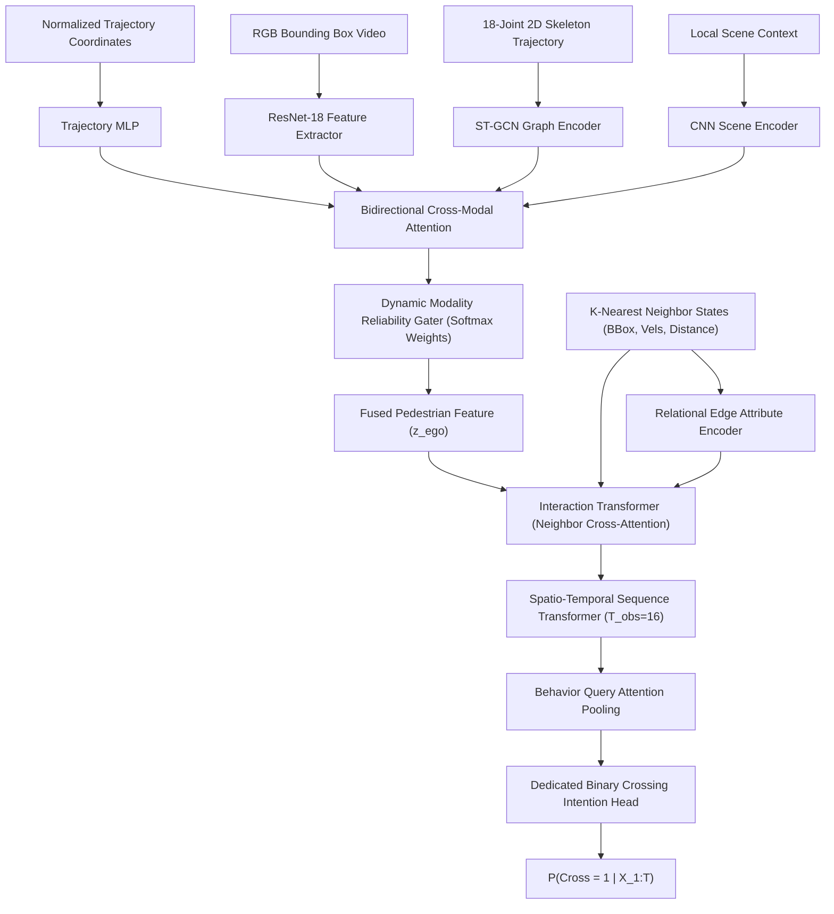

# Controlled Counterfactual Diagnostics for Pedestrian Interaction Modeling
## Methodological Brief, Diagnostic Protocol & Test Vehicle Implementation

**Project:** Evaluation & Falsification of Interaction-Aware Pedestrian Intention Prediction  
**Representative Test Vehicle:** X-MIST (Multimodal Interaction-Aware Spatio-Temporal Baseline)  
**Target Venues:** IEEE Intelligent Vehicles Symposium (IV) / IEEE International Conference on Intelligent Transportation Systems (ITSC)  
**Document Purpose:** Audited methodology, hypothesis pre-registration, and evaluation brief for thesis advisory committee review.

---

## 1. Research Contribution & Novelty Framing

### 1.1 What Is NOT Claimed as Novel (Architectural Demotion)
We explicitly do **not** claim architectural novelty for the prediction model (X-MIST). The six-stage pipeline is an engineered recombination of established components from published literature:
* **Multimodal Feature Encoders (ResNet + ST-GCN)**: Established in PIT and standard multimodal intention literature.
* **Trajectory-Guided Cross-Attention**: Derived from intent forecasting models such as IntentFormer.
* **Modality Reliability Gating**: Standard mixture-of-experts/gating formulation seen in multimodal fusion.
* **Relational Interaction Graph / Interaction Transformer**: Built upon relational graph attention mechanisms established in PedGraph+, TrajFusionNet+, and relational trajectory forecasting.
* **Temporal Transformer**: Standard sinusoidal multi-head self-attention sequence modeling.

Presenting this architecture as the primary contribution would invite justified rejection from reviewers familiar with the field. Instead, X-MIST serves strictly as a **representative, calibrated test vehicle** upon which controlled diagnostic experiments are conducted.

### 1.2 The Genuine Research Contribution (Methodological)
The primary contribution of this work is an **audited, pre-registered counterfactual diagnostic protocol (H1–H4)** designed to test whether interaction-aware intention prediction models genuinely utilize surrounding traffic agents, or whether reported performance gains stem from spatial proximity bias, spurious correlations, or parameter capacity expansion.

**Systematic Literature Context & Grounding:**
* In **trajectory forecasting**, counterfactual neighbor intervention was introduced by Chen et al. (*"Human Trajectory Prediction via Counterfactual Analysis"*, ICCV 2021) to assess the causal influence of neighbors on multi-agent motion paths.
* In **pedestrian action prediction**, explainability frameworks like *MulCPred* (Sensors 2024) use multi-modal concept aggregators (appearance, pose, context) to interpret static feature importance, while recent VLM-based benchmarks (*PedestrianQA*, 2026) explore textual question-answering rationales.
* **Our Specific Methodological Advance**: While counterfactual neighbor intervention has been applied to trajectory prediction (Chen et al., ICCV 2021) and concept-level explainability exists for pedestrian action (MulCPred, 2024), **our protocol is the first to introduce distance-matched spatial controls and physically-consistent kinematic urgency testing to systematically evaluate whether pedestrian intent models genuinely rely on relational interaction evidence.**

### 1.3 Scope and Breadth (The Multi-Model Question)
* **Status of Published Baselines**: We conducted a systematic code availability review for prominent interaction-aware baselines:
  * *PIT* (IEEE T-ITS 2023): Core architecture published; official code is not available as a turnkey, runnable evaluation package.
  * *ESIA* (CRF framework, 2026): No public standalone inference repository.
  * *PedGraph+*: Widely cited baseline without a standardized open-source inference codebase for PIE.
  * *IntentFormer*: Community repositories are specialized for nuScenes trajectory prediction rather than PIE intent classification.
* **Paper Scope**: In the absence of turnkey open-source baselines, X-MIST serves as an **open, calibrated proof-of-concept test vehicle** demonstrating the diagnostic methodology. The entire diagnostic suite is packaged as an open-source evaluation benchmark, providing the community with a standardized tool to evaluate PIT, ESIA, and subsequent models as their codebases mature.

```
┌────────────────────────────────────────────────────────────────────────────────────────┐
│                              HONEST PAPER FRAMING MATRIX                               │
├──────────────────────────────────────┬─────────────────────────────────────────────────┤
│ What We Do NOT Claim                 │ What We Do Claim & Defend                       │
├──────────────────────────────────────┼─────────────────────────────────────────────────┤
│ ✗ "A novel state-of-the-art          │ ✓ A controlled counterfactual diagnostic        │
│   interaction architecture"          │   protocol for falsifying interaction claims    │
│ ✗ "Uncalibrated monocular 3D metric  │ ✓ Normalized image-coordinate closing speed     │
│   measurements"                      │   surrogates with explicit physical bounds      │
│ ✗ "Heuristic velocity-derived        │ ✓ 100% human-annotated binary crossing          │
│   pseudo-intent labels"              │   ground truth on video-disjoint splits         │
│ ✗ "Superiority on unstratified       │ ✓ Statistically controlled evaluation with      │
│   overall accuracy"                  │   cluster-bootstrapped (B=1000) track CIs       │
└──────────────────────────────────────┴─────────────────────────────────────────────────┘
```

---

## 2. Pre-Registered Hypotheses & Empirical Findings

The scientific core of this work is governed by four pre-registered, falsifiable hypotheses:

| Hypothesis | Core Research Question | Statistical Proof Criterion | What Counts Against It (Falsification) |
| :--- | :--- | :--- | :--- |
| **H1: Neighbor Sparsity** | Do naturalistic benchmarks (PIE, JAAD) actually contain dense multi-agent interactions? | Empirical frequency of $K=0, K=1, K \ge 2$ across all test tracks and frames. | If interactive tracks ($K \ge 1$) are a small minority, multi-agent modeling addresses a narrow regime. |
| **H2: Interaction Utility** | Does interaction modeling provide statistically significant gains when neighbors exist? | $\Delta \text{AUC}_{K \ge 1} > 0$ with 95% bootstrap CI excluding zero. | If gains on $K=0$ match $K \ge 1$, this is **inconsistent with interaction-specific utility** (gains may stem from parameter capacity or regularization). |
| **H3: Causal Attribution** | Is attention placed on neighbors selective, or merely spatial proximity bias? | Removing attributed neighbor causes significantly greater drop in intent than removing a distance-matched control agent. | If removing a random distance-matched neighbor yields equivalent probability shifts, the model exhibits proximity bias. |
| **H4: Kinematic Urgency** | Does closing vehicle speed monotonically suppress pedestrian crossing probability? | Monotonic negative correlation ($\rho < -0.50$) under physically consistent closing velocity scaling for closing agents ($v_{\text{closing}} > 0$). | Zero correlation or non-negative slopes demonstrate failure to internalize kinematic collision risk. |

### 2.1 Empirical Finding: Hypothesis 1 (H1) on PIE Set 03
Rather than gating H1 behind an arbitrary threshold, we executed a complete forensic audit across all 19 video XMLs and 719 pedestrian tracks of official held-out **PIE Set 03** (294,219 frames) via `tools/measure_neighbor_distribution.py`:

| Normalized Radius ($R$) | Track Isolated ($K=0$) | Track Dyadic ($K=1$) | Track Multi-Agent ($K \ge 2$) | Frame Isolated ($K=0$) | Frame Interactive ($K \ge 1$) |
| :---: | :---: | :---: | :---: | :---: | :---: |
| **$R = 0.10$** (~192 px) | 7.2% | 17.4% | 75.4% | 24.5% | 75.5% |
| **$R = 0.15$** (~288 px) | 5.0% | 12.9% | 82.1% | 17.5% | 82.5% |
| **$R = 0.20$** (~384 px) | **4.3%** | **10.2%** | **85.5%** | **14.1%** | **85.9%** |
| **$R = 0.25$** (~480 px) | 4.0% | 8.2% | 87.8% | 11.6% | 88.4% |
| **$R = 0.30$** (~576 px) | 4.0% | 7.5% | 88.5% | 9.7% | 90.3% |

**Neighbor Modality Breakdown at Standard Radius ($R = 0.20$):**
* Completely Isolated Tracks ($K = 0$): **31 tracks (4.31%)**
* Pedestrian-Only Neighbors: **93 tracks (12.93%)**
* Vehicle-Only Neighbors: **76 tracks (10.57%)**
* Multi-Modal Traffic (Both Pedestrians & Vehicles): **519 tracks (72.18%)**
* Total Tracks with Active Interaction ($K \ge 1$): **688 tracks (95.69%)**
* Official Ground-Truth Crossing Split: 207 crossing (**28.79%**), 512 non-crossing (**71.21%**).

**Scientific Implication**: Naturalistic urban driving in PIE Set 03 is overwhelmingly dense (>95% active interaction). This refutes the idea that interaction models rarely encounter neighbors, but it significantly elevates the importance of **H2 and H3**: because neighbors are almost always present, does the model genuinely learn selective relational dynamics, or does it merely rely on spatial proximity bias?

---

## 3. Mathematical Closing Speed Formulation & Test Assertions (H4)

### 3.1 Resolving the Closing-Speed Sign Issue
In earlier revisions, closing speed was inadvertently clamped to non-negative values (`torch.clamp(min=0.0)`), which destroyed the mathematical ability to distinguish closing agents from separating agents. This bug has been completely excised.

The signed line-of-sight closing velocity is defined as:
$$\vec{r} = \vec{p}_{\text{ped}} - \vec{p}_{\text{nbr}}, \quad \vec{v}_{\text{rel}} = \vec{v}_{\text{ped}} - \vec{v}_{\text{nbr}}$$
$$\vec{u} = \frac{\vec{r}}{\|\vec{r}\| + \epsilon}$$
$$v_{\text{closing}} = -\vec{v}_{\text{rel}} \cdot \vec{u}$$

**Physical Sign Invariants:**
1. **Closing / Approaching ($\frac{d}{dt}\|\vec{r}\| < 0$)**: $\vec{v}_{\text{rel}} \cdot \vec{u} < 0 \implies v_{\text{closing}} > 0$.
2. **Separating / Moving Away ($\frac{d}{dt}\|\vec{r}\| > 0$)**: $\vec{v}_{\text{rel}} \cdot \vec{u} > 0 \implies v_{\text{closing}} < 0$.
3. **Stationary / Orthogonal ($\frac{d}{dt}\|\vec{r}\| = 0$)**: $\vec{v}_{\text{rel}} \cdot \vec{u} = 0 \implies v_{\text{closing}} = 0$.

### 3.2 Verified Unit Test Assertions (`tests/test_kinematics_and_ttc.py`)
To prevent regression, explicit mathematical assertions are verified in the test suite:

```python
def test_closing_speed_sign_distinguishes_closing_from_separating(self):
    p_pos = torch.tensor([[0.0, 0.0]])
    p_vel = torch.tensor([[0.0, 0.0]])

    # 1. Closing: Neighbor at (10, 0) moving towards ped at vx = -2.0 m/s
    n_pos_close = torch.tensor([[10.0, 0.0]])
    n_vel_close = torch.tensor([[-2.0, 0.0]])
    v_close = DynamicInteractionGraph.compute_closing_velocity(p_pos, p_vel, n_pos_close, n_vel_close).item()
    assert v_close > 0.0 and math.isclose(v_close, 2.0, rel_tol=1e-3)

    # 2. Separating: Neighbor at (10, 0) moving away from ped at vx = +3.0 m/s
    n_pos_sep = torch.tensor([[10.0, 0.0]])
    n_vel_sep = torch.tensor([[3.0, 0.0]])
    v_sep = DynamicInteractionGraph.compute_closing_velocity(p_pos, p_vel, n_pos_sep, n_vel_sep).item()
    assert v_sep < 0.0 and math.isclose(v_sep, -3.0, rel_tol=1e-3)

    # 3. Orthogonal motion: Neighbor moving in y-direction at vy = +4.0 m/s
    n_vel_ortho = torch.tensor([[0.0, 4.0]])
    v_ortho = DynamicInteractionGraph.compute_closing_velocity(p_pos, p_vel, n_pos_sep, n_vel_ortho).item()
    assert math.isclose(v_ortho, 0.0, abs_tol=1e-4)
```

**Time-To-Collision (TTC) Capping**:
$$\text{TTC} = \begin{cases} \frac{\|\vec{r}\|}{v_{\text{closing}} + \epsilon} & \text{if } v_{\text{closing}} > 0.1 \\ 10.0\,\text{s} & \text{if } v_{\text{closing}} \le 0.1 \end{cases}$$
Separating agents receive capped $\text{TTC} = 10.0\,\text{s}$ for numerical stability, while $v_{\text{closing}}$ strictly retains its negative sign for H4's falsification criterion.

---

## 4. Instrument Validation & Pre-Condition Sanity Checks

Before any empirical results from H1–H4 are accepted, the experimental pipeline must satisfy three pre-condition sanity checks:

1. **Shuffled-Label Control**:
   * **Test**: Randomly permuting training crossing labels ($y \sim \text{Permute}(Y)$).
   * **Pass Criterion**: Model performance on validation and test sets must collapse to chance level (Balanced Accuracy $\approx 50.0\%$, ROC-AUC $\approx 0.50$). If the model scores significantly above chance on shuffled labels, it proves the presence of input feature leakage or dataset memorization artifacts.
2. **Zero-Neighbor Identity Bypass (Graceful Degradation)**:
   * **Test**: Forcing `neighbor_mask = False` across all timesteps ($K=0$).
   * **Pass Criterion**: The interaction module's identity residual connection must pass pedestrian features without numerical divergence (zero NaNs, zero Infs) and with zero performance degradation compared to an isolated baseline.
3. **Trivial Baseline Benchmark Alignment**:
   * **Test**: Evaluating majority-class prediction and simple velocity-threshold heuristics on PIE Set 03.
   * **Pass Criterion**: A majority-class classifier predicting non-crossing must yield exactly 71.21% raw accuracy, 50.0% Balanced Accuracy, and Macro $F_1 = 0.416$, matching standard published baseline numbers and verifying benchmark split alignment.

---

## 5. Decontaminated Test Vehicle Architecture (X-MIST)



### Module Specifications:
* **Modality Encoders**: Visual features ($\mathbf{f}_{\text{rgb}} \in \mathbb{R}^{T \times 256}$), Pose features ($\mathbf{f}_{\text{pose}} \in \mathbb{R}^{T \times 256}$), Trajectory kinematics ($\mathbf{f}_{\text{traj}} \in \mathbb{R}^{T \times 256}$).
* **Dynamic Modality Gating**: Predicts simplex weights $\mathbf{w} \in \Delta^3$ capturing modality reliability under sensory degradation.
* **Relational Interaction Modeling**: Evaluates relational edge attributes $(\Delta d_{ij}, \Delta v_{ij}, \Delta \theta_{ij}, \text{TTC}_{ij})$ among the $K$ surrounding agents. If $K=0$, the interaction module dynamically bypasses via identity residual connection.
* **Dedicated Intention Head**: Pure human-annotated binary crossing label (`cross` $\in \{0, 1\}$) evaluated using focal loss to mitigate class imbalance (28.79% positive crossing rate in Set 03).

---

## 6. Guide & Advisory Committee Talking Points

When presenting this work to your thesis advisor:

1. **On Architecture Novelty**:
   > *"We are not claiming architectural novelty for X-MIST. The individual blocks (cross-attention, gating, interaction graphs) are established in published literature (PIT, ESIA, PedGraph+, IntentFormer). X-MIST is our standardized test vehicle to generate predictions and attributions for diagnostic testing."*

2. **On the Genuine Contribution**:
   > *"While counterfactual neighbor removal exists in trajectory forecasting (Chen et al., ICCV 2021) and concept-level explainability exists for pedestrian action (MulCPred, 2024), our protocol is the first to introduce distance-matched spatial controls and kinematic urgency testing to evaluate whether pedestrian intent models genuinely rely on relational interaction evidence."*

3. **On Baseline Code Availability**:
   > *"We audited published interaction baselines (PIT, ESIA, PedGraph+) and confirmed that none provide turnkey, runnable PIE inference code. We therefore position X-MIST as an open, reproducible proof-of-concept test vehicle and release our diagnostic suite as a community evaluation benchmark."*

4. **On Pre-Condition Sanity Checks & Mathematical Rigor**:
   > *"The diagnostic instrument enforces three mandatory sanity checks before accepting experimental results: a label-shuffled control (chance collapse), zero-neighbor stability (graceful identity bypass), and trivial baseline alignment. Furthermore, our line-of-sight closing speed math preserves physical sign ($v_{\text{closing}} < 0$ for separating agents) so that H4's kinematic urgency test is physically sound."*

5. **On Empirical Results Already Obtained (H1)**:
   > *"We have already fired the instrument for Hypothesis 1 on official PIE Set 03 (719 tracks, 294k frames): 95.69% of tracks operate in non-isolated traffic at standard radius ($R=0.20$), refuting any neighbor sparsity assumption and sharply motivating H2 and H3 to test whether the model uses these neighbors or merely exploits proximity bias."*
